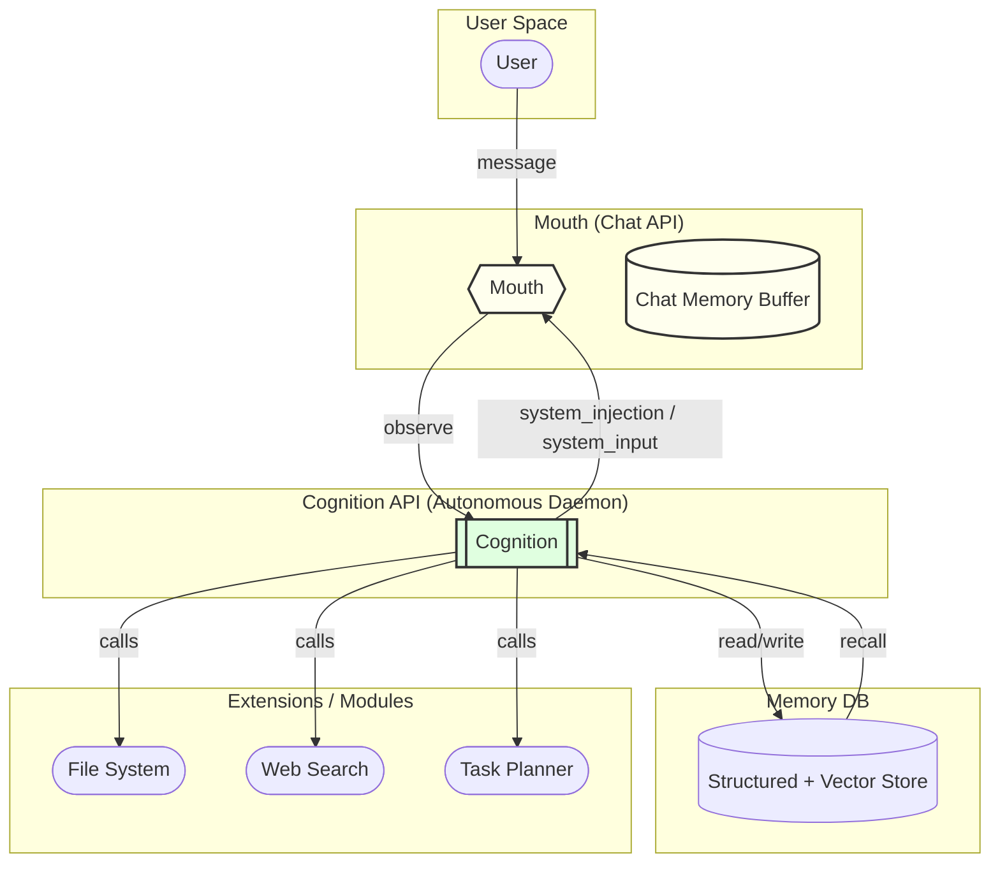

# Black Cat Architecture - Fixed Diagram

**Issues Fixed:**
1. Subgraph titles need quotes when they contain spaces/parentheses
2. Style declarations moved to end with `classDef` approach
3. Arrow labels use `|label|` syntax instead of `-- label -->`